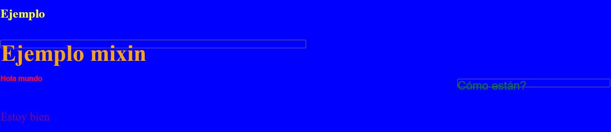

# Practice Page - Sass

> I created these files in order to learn how Sass works.

Practice Page Sass
This website was created with the purpose of understanding the operation of Sass.
In this project, I am looking to adapt to the use of Sass in web development

## Built With

- Sass 1.32.7
- HTML5
- CSS3
- Git
- Github
- Lintern
- VSCode

## Live Demo

[Live Demo Link](https://aristides1000.github.io/practices-with-sass/)

## Getting Started

This project was created with the purpose of studying the differences between Sass and Css in the development of styles.

### Prerequisites

Computer running Mac OS, Windows, or Linux Ubuntu. Internet browser: Firefox, Google Chrome, Opera...

### Install

Getting Started
To get a local copy up and running follow these simple example steps:

- You need to [clone](https://docs.github.com/en/github/creating-cloning-and-archiving-repositories/cloning-a-repository) or [download as zip file](https://www.itprotoday.com/mobile-management-and-security/how-do-i-download-files-github) the repository on your device.
- [Unzip](http://www.e7z.org/open-zip.htm) the repository or just clone it using git or github.
- [Grab the index.html file and open it on your favorite browser.](https://helpdeskgeek.com/how-to/open-an-html-file-in-google-chrome/)
- If you want to see the source code of the files located in my repository, you can do it through a [code editor of your choice](https://www.elegantthemes.com/blog/resources/best-code-editors), I recommend using [VSCode](https://code.visualstudio.com/), first, you must [install it by following these steps](https://code.visualstudio.com/docs), then you must [open the folder containing my repository in your local repository](https://thisdavej.com/right-click-on-windows-folder-and-open-with-visual-studio-code/#:~:text=You%20can%20now%20navigate%20to,with%20VS%20Code%E2%80%9D%20as%20well.) and [open each of the files](https://code.visualstudio.com/docs/editor/editingevolved) to see their content.
- If you have any questions or problems about how to run this project, you can leave me a comment in the [issues section](https://github.com/aristides1000/using-bootstrap/issues) of this repository, I am more than willing to help you.

### Usage
Run the index.html file.

### Run tests
Linters errors

## Authors

👤 **Author1**
Aristides Jose Molina Pérez

- GitHub: [@aristides1000](https://github.com/aristides1000)
- Twitter: [@aristides_1000](https://twitter.com/@aristides_1000)
- LinkedIn: [aristides jose molina perez](https://www.linkedin.com/in/aristides-jose-molina-perez-09b0579a)

## 🤝 Contributing

Contributions, issues, and feature requests are welcome!

Feel free to check the [issues page](https://github.com/aristides1000/practices-with-sass/issues).

## Show your support

Give a ⭐️ if you like this project!

## Acknowledgments

- Ariel Camus CEO Microverse: For letting us start this journey.
- Google: For letting us find crucial information in order to create this project.
- [Sass](https://sass-lang.com/): For creating this CSS precompiler
